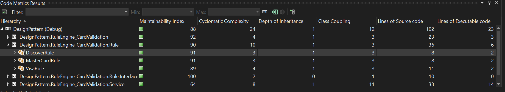

# DesignPattern

## Rule Engine
Use Open/Closed Princples in Soild Princples which makes the code more readable and robust

## Code Metric

cyclomatic must be lower than 11 if it is higher then the code needs to be refactored
